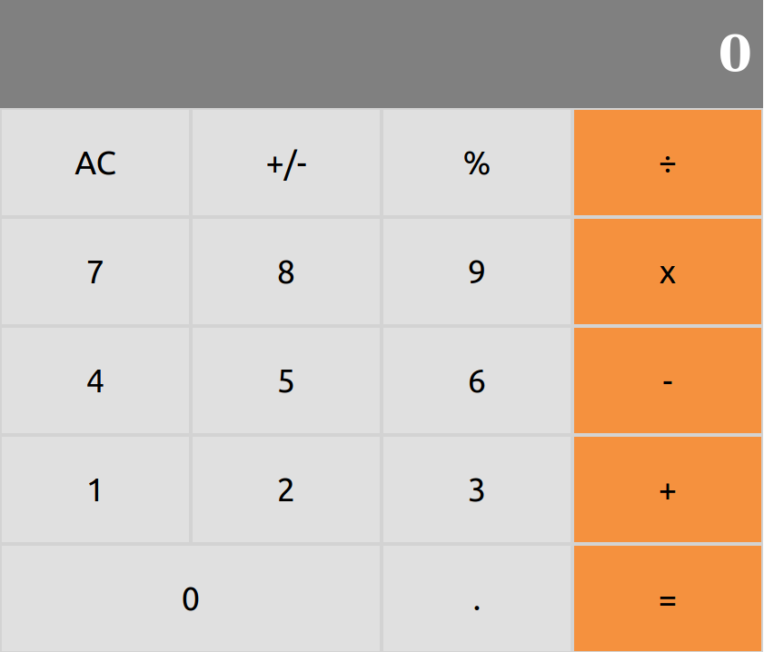

# React-Calculator

This project is a calculator for Math-magicians Inc, It was built using create-react-app, a tool built by developers at Facebook to help build React applications, saving you from time-consuming setup and configuration.

## Preview

## Instructions

To install the project follow these instructions:

- Click on ***code*** and clone with SSH
- Go to wherever you want to store the game
- Open your terminal and type **git init** and enter
- Then type **git clone** -*paste the link copied*- and enter
- Finally open the project with your IDE (e.g: Visual Studio Code)
- Open the terminal from that project
- Run 'npm start'

## Built With

- Node.js
- React
- React-DOM
- [React-Create-App](https://github.com/facebook/create-react-app)
- npm
- CSS
- ES6
- [Prop-types](https://www.npmjs.com/package/prop-types)
- [Big.js](https://github.com/MikeMcl/big.js/)

## Live Demo

[Live Demo Version](https://react-calc1535.herokuapp.com/)

## Author

👤 **Brenda Yucra**

- Github: [@bren2102](https://github.com/bren2102) 
- Twitter: [@BrendaYucra2](https://twitter.com/BrendaYucra)
- Linkedin: [Brenda Yucra](https://www.linkedin.com/in/brenda-yucra-51980681/)

## 🤝 Contributing

Contributions, issues and feature requests are welcome!

Feel free to check the [issues page](https://github.com/bren2102/Calculator-react/issues).

## Show your support

Give a ⭐️ if you like this project!